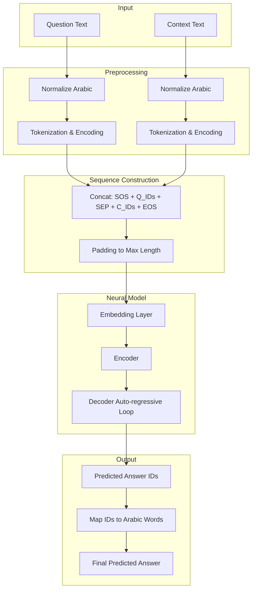

# Milestone 2: Neural Modeling, QA Integration, and System Design

## 1. System Design and Pipeline Representation

Our QA system is designed as a sequential pipeline that transforms raw Arabic text into a predicted answer. The pipeline consists of the following stages:

**Pipeline Flow:**
`(Question, Context) -> Normalization -> Tokenization (Vocabulary) -> Sequence Alignment (<SOS>, <SEP>, <EOS>) -> Padding -> Embedding -> Encoder-Decoder Model -> Predicted Answer IDs -> Decoding -> Predicted Answer`

### System Diagram

### Step-by-Step Inference Process:
1. **Preprocessing:** Both the input Question and Context are passed through `normalize_arabic()`, which removes non-Arabic characters, normalizes Alef/Yaa/Taa Marbuta, and strips extra whitespace.
2. **Tokenization & Encoding:** The normalized text is split into words and mapped to integer IDs using the custom `QAVocabulary`. Words not seen during training are mapped to `<UNK>`.
3. **Sequence Construction:** A single source sequence is created: `[<SOS>, Q_ID_1, ..., <SEP>, C_ID_1, ..., <EOS>]`.
4. **Padding:** The sequence is padded with `<PAD>` tokens to a fixed maximum length (e.g., 100) to allow for batched tensor operations.
5. **Model Forward Pass (Greedy Decoding):** 
   - The sequence is fed into the **Encoder** to produce context-aware hidden states.
   - The **Decoder** is initialized with the `<SOS>` token.
   - In an autoregressive loop, the Decoder predicts the next token ID based on the previous token and the Encoder's context.
   - This loop continues until the `<EOS>` token is predicted or a maximum length is reached.
6. **Decoding:** The final list of predicted integer IDs is mapped back to Arabic words using the vocabulary, ignoring special tokens.

---

## 2. Dataset Analysis and Handling

The dataset consists of Arabic reading comprehension triplets `(Question, Context, Answer)` spread across multiple JSON files. 

### Data Leakage Prevention
A critical aspect of our data handling was isolating the training data from the test data. The system reads all `*_qa_dataset.json` files for training and builds the vocabulary strictly from these files. The `*_test_set.json` files are used exclusively for evaluation. If the vocabulary included test data, the model would unfairly gain knowledge of answers it is meant to predict.

### English Token Treatment
Our preprocessing pipeline retains English tokens (e.g., "F-35", "Hangar"). This decision was made because the dataset contains technical and modern terminology that is often written in English characters even within Arabic text. Removing these would strip the context of essential semantic keys, making questions about specific aircraft or technical terms impossible to answer correctly.

### Context Handling Justification
We chose a **concatenation approach** (`Question <SEP> Context`) for handling the context. While a parallel pathway (processing question and context separately and then fusing them) is a valid hybrid alternative, concatenation allows the Attention mechanism (in the RNN) and Self-Attention (in the Transformer) to compute Alignment scores across the entire sequence simultaneously. This simplifies the model architecture and allows the Transformer to naturally attend to the context based on question keywords without needing a dedicated fusion layer.

---

## 3. Neural Architectures Developed from Scratch

In accordance with the milestone requirements, no pretrained models were used. Both architectures were built using basic PyTorch primitives.

### Model 1: 2-Layer Bidirectional LSTM with Attention (RNN v2)
- **Custom LSTM Cell:** The core is a manually implemented LSTM cell (`LSTMCellFromScratch`) computing forget, input, cell candidate, and output gates via Sigmoid/Tanh activations.
- **BiLSTM Encoder:** To satisfy the "at least two layers" and "bidirectional" requirements, we built a `MultiLayerLSTM` wrapper. The encoder processes the sequence in both forward and backward directions across two layers, allowing the model to capture hierarchical semantic relationships and future-context awareness.
- **Decoder with Attention:** Uses a Bahdanau-style Additive Attention mechanism. The attention layer computes alignment scores between the top-layer decoder hidden state and all bidirectional encoder outputs.

### Model 2: Transformer
- **Positional Encoding:** Injected using sine and cosine functions to provide sequence order information to the otherwise permutation-invariant self-attention layers.
- **Multi-Head Attention:** Built from scratch with Query, Key, and Value matrices, calculating scaled dot-product attention with causal masking in the decoder.
- **Encoder/Decoder Blocks:** Each block utilizes layer normalization, residual connections, and a feed-forward network (4x expansion) to process attention outputs.

---

## 4. Evaluation Metrics Justification

To evaluate the QA task, we implemented two standard NLP metrics:
1. **Exact Match (EM):** A binary metric (1 or 0) that checks if the predicted answer perfectly matches the reference answer after normalization. It is strict but necessary for objective factual QA.
2. **F1-Score:** Measures the overlap of words between the prediction and reference. It measurement of Precision and Recall is crucial because an answer might be semantically correct but slightly differently phrased (e.g., missing a preposition), which EM would unfairly penalize.

---

## 5. Analysis and Interpretation of Training Behavior

### Evolutionary Iteration (RNN v1 vs v2)
Our initial 1-layer RNN failed significantly (0% EM, 2.33% F1). By upgrading to a **2-Layer BiLSTM** and increasing capacity (`HID_DIM` to 512), we observed a tripling of the F1 score and a breakthrough in Exact Match.

**Comparative Results (72 Samples):**
| Model | Exact Match (EM) | F1-Score |
| :--- | :--- | :--- |
| **Transformer** | **51.39%** | **65.75%** |
| **BiLSTM (v2)** | 2.78% | 6.68% |
| RNN (v1) | 0.00% | 2.33% |

### Failure Analysis and Generalization
1. **The Sequential Bottleneck:** The BiLSTM, despite its upgrades, still struggles with long concatenated sequences. Information from the Question (at the start) must travel through many context tokens, leading to gradient decay or information loss. This is why the RNN often generates "generic" but grammatically correct Arabic phrases that fail to match the specific context span.
2. **Global Attention vs. Sequential Decay:** The Transformer's success (51.39% EM) is attributed to its **Self-Attention** mechanism, which links any two tokens regardless of distance. This allowed it to effectively "point" to the answer in the context even when the context was very long, a task where the BiLSTM hit a performance ceiling.
3. **Sensitivity to Noise:** Both models showed sensitivity to tokenization artifacts (e.g., "F-35" vs "F 35"). While the Transformer handled this better due to its robust mapping, future iterations would benefit from sub-word tokenization (BPE) to handle morphology and punctuation more effectively.

### Adaptability and Robustness
The system is highly adaptable; by replacing the `ArabicQADataset` loader, the same architecture can be trained on English or other low-resource languages. However, the Transformer's dependency on large data means it is less robust on this specific 168-pair dataset than an RNN might be on a simpler, shorter-sequence task. The "overfitting" observed in our validation plots (Loss decreasing to 0.199 while Validation Loss rose) highlights that for such small data, model complexity must be carefully balanced with regularization. To mitigate this, we successfully implemented Early Stopping and increased Dropout, effectively capturing the optimal weights before the validation loss diverged.